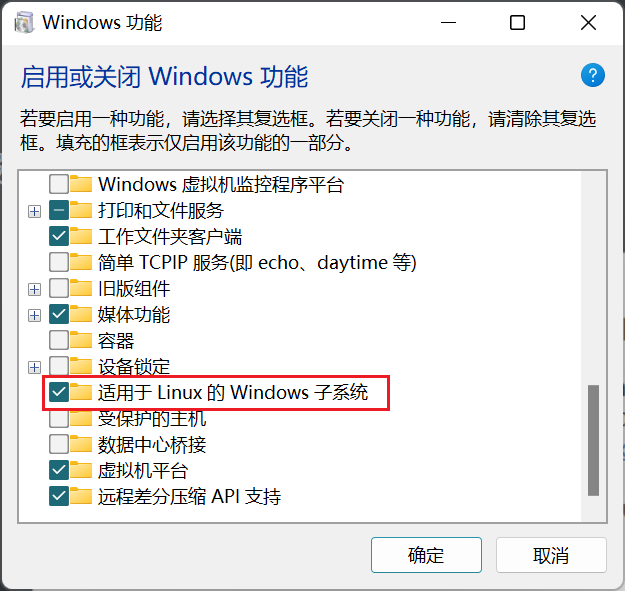

---


title: docker教程

date: 2021-11-15 10:10:33


---

## 第1章 docker 简介

### 1.1 docker的出现

运维工程师需要大量的配置环境，每有一台新的服务器，就需要重装所有的软件，一个一个下载，一个一个配置，而且开发者需要写非常详细的部署说明，即便这样，依然会出现在开发者的电脑上可以运行，而到运维者的电脑上无法运行，于是dock镜像出现了。

开发者将自己电脑上的配置环境，运行环境，依赖包，操作系统，内核，数据，代码等等，全部打包封装成一个镜像，而运维只需要安装这一个镜像，大大减少了配置的成本。

docker是基于go语言实现得到云开源项目。docker的理念就是一次封装，到处运行。解决了运行环境和配置问题软件容器，方便做持续集成并有助于整体发布的容器虚拟化技术。

虚拟机的缺点，资源占用多，冗余步骤多，启动慢。docker不是模拟出一个完整的操作系统，而是一个linux容器，依赖于宿主的内核，没有自己的内核。

### 1.2 docker安装

#### 1.2.1 centos版docker


```bash
# 卸载旧版本
sudo yum remove docker \
              docker-client \
              docker-client-latest \
              docker-common \
              docker-latest \
              docker-latest-logrotate \
              docker-logrotate \
              docker-engine
              
# 更新工具
sudo yum install -y yum-utils \
  device-mapper-persistent-data \
  lvm2
  
# 配置加速源
sudo yum-config-manager --add-repo http://mirrors.aliyun.com/docker-ce/linux/centos/docker-ce.repo

# 安装最新版本的Docker
sudo yum install docker-ce docker-ce-cli containerd.io
```


#### 1.2.2 ubuntu版docker


```sh
# 卸载旧版本
sudo apt-get remove docker docker-engine docker.io containerd runc

# 更新软件源
sudo apt-get update

# 安装工具
sudo apt-get install \
    apt-transport-https \
    ca-certificates \
    curl \
    gnupg-agent \
    software-properties-common
    
# 添加Docker官方GPG key
curl -fsSL https://mirrors.aliyun.com/docker-ce/linux/ubuntu/gpg | apt-key add -

# 验证指纹
sudo apt-key fingerprint 0EBFCD88

# 添加仓库
sudo add-apt-repository \
   "deb [arch=amd64] https://mirrors.aliyun.com/docker-ce/linux/ubuntu \
   $(lsb_release -cs) \
   stable"

# 更新软件源
sudo apt-get update

# 安装docker
sudo apt-get install docker-ce docker-ce-cli containerd.io
```


#### 1.2.3 windows版docker

运行环境需要开启功能 hyper-v 或 wsl2

推荐 wls2 因为 性能更好 ,  而且开启 hyper-V 会与 vm虚拟机冲突


下载windows安装包

https://desktop.docker.com/win/main/amd64/Docker%20Desktop%20Installer.exe


开启功能 适用于linux的windows子系统




如果出现报错 , 更新 wsl2 版本

https://wslstorestorage.blob.core.windows.net/wslblob/wsl_update_x64.msi


### 1.3 基本应用安装

nginx docker-compose.yml

```shell
docker pull nginx

docker run -d --name nginx01 -p 80:80 \
-v /Users/wl/Projects/docker/nginx/html:/usr/share/nginx/html \
-v /Users/wl/Projects/docker/nginx/nginx.conf:/etc/nginx/nginx.conf \
-v /Users/wl/Projects/docker/nginx/logs:/var/log/nginx \
nginx

docker ps
```

tomcat8  docker-compose.yml

```shell
docker pull tomcat
docker run -d -p 3355:3355 --name tomcat01 tomcat


```

redis6  docker-compose.yml


mysql8.0.21  docker-compose.yml


jkd1.8  docker-compose.yml


### 1.4 可视化portainer


创建

```bash
docker volume create portainer_data
```


安装

```bash
docker run -d -p 8000:8000 -p 9443:9443 --name portainer \
    --restart=always \
    -v /var/run/docker.sock:/var/run/docker.sock \
    -v portainer_data:/data \
    portainer/portainer-ce:latest
```


登录

https://localhost:9443


账号密码


### 1.5 基本指令

`service docker start ` 启动

`docker version`   查看版本

`docker info`    查看详细信息

`docker xx -helo`   查看指令帮助

`docker run hello-world`   测试官方demo


## 第2章 镜像

### 2.1 镜像简介


### 2.2 指令

`docker images -a`        # 查看本地主机上的所有镜像

`docker pull mysql`       # 拉取镜像

`docker pull nginx:5.7`   # 指定版本拉取

`docker rmi -f mysql`     # 删除指定镜像

`docker rmi -f $(docker images -aq)`  # 删除全部镜像

​

## 第3章 容器

### 3.1 容器简介


创建多个容器只改外部端口 不改内部端口

```bash
docker run -d -p 3355:3355 --name tomcat01 tomcat

docker run -d -p 3356:3355 --name tomcat01 tomcat

docker run -d -p 3357:3355 --name tomcat01 tomcat


```


### 3.2 指令

#### 3.2.1 指令选项


docker run --name=mynginx  -d  -- restart=always nginx

--name="name"   命名

-d   后台方式

-it   交互方式

-p 80:80 指定端口

-- restart=always  开机时自动启动

-v 主机地址 : 容器内地址 -v .....    # 数据挂载


#### 3.2.2 所有指令

docker update name --restart=always  # 更新容器的设置项

docker run -it centos /bin/bash   # 运行并进入容器

exit     #停止并退出容器

docker ps       # 查看正在运行的容器

docker ps -a    # 查看历史所有运行过的容器

docker rm 容器id

docker rm -f $(docker ps -aq)   # 删除所有容器

docker start 容器id   # 启动容器

docker restart 容器id  # 重启容器

docker stop 容器id  # 停止容器

docker kill 容器id  # 杀死容器

docker top 容器id   # 查看容器中的进程今

docker logs -tf 容器id   # 查看日志

docker inspect 容器id  # 查看镜像的元数据

docker logs 容器id [-f ] # 查看容器的日志 [-f 实时模式]


#### 3.2.3 进入容器内部

docker exec -it centos  /bin/bash  # 进入当前正在运行的容器，使用容器内的终端

exit  # 退出容器内的终端

docker attach 容器id     # 不开启新的终端

docker cp 容器id:容器内路径 主机目录  # 把容器内文件复制到主机 ,也可以反向复制


#### 3.2.4 注意

docker run -d centos

docker ps

后台运行容器，需要前台进程，不然会自杀


### 2.3 容器分享

#### 2.3.1 本地分享

把已经配置好的容器 提交为新的容器

docker commit -a "auther" -m "提交信息" 当前容器id myname:1.0

把容器保存为一个物理文件

docker save -o xxx.tar myname:1.0

其他主机装载该容器

docker load -i xxx.tar


#### 2.3.2 远程仓库

更改名字 前面要有自己的docker账号名

docker tag myname:1.0  leifengyang/myname:1.0

命令行登录docker账号

docker login

推送到docker仓库

docker push leifengyang/myname:1.0

查看镜像页面有下载命令

docker pull ....


## 第4章 卷

### 4.1 简介

Docker镜像被存储在一系列的只读层中。当我们创建一个容器时，Docker会读取镜像（只读），并在其顶部添加一层读写层。如果正在运行中的容器修改了现有文件，该文件将会被拷贝出底层的只读层，放到最顶层的读写层中。读写层中原来的旧版本文件（未被更改过的文件）仍然存在于镜像中。

所以当Docker容器被删除后，再基于原来的镜像创建容器时，将创建一个没有任何数据更改的容器，在之前那个容器中的数据更改会丢失掉。只读层和读写层的组合被Docker称为联合文件系统（Union File System）。

为了能够持久化这些更改过的数据，并且能够很容易实现容器间共享数据，Docker提出了Volume的概念。Volume是外部默认的联合文件系统或者是存在于宿主文件系统中正常的文件或文件夹。

数据卷的最大特点是：其生存周期独立于容器的生存周期。


**问题：**

不能在宿主机上很方便地访问容器中的文件。

无法在多个容器之间共享数据。

当容器删除时，容器中产生的数据将会丢失。

为了解决这些问题，Docker引入了数据卷(Volume) 机制。数据卷以独立于Docker文件系统的形式存在于宿主机中。


**好处：**

数据卷可在容器之间共享或重用数据。

数据卷的更改可以直接生效。

数据卷的生命周期一直持续到没有容器使用它为止。

对数据卷操作不会影响到镜像本身。

数据卷可以完成容器到宿主机、宿主机到容器以及容器到容器之间的数据共享。


### 4.2 指令

`docker volume help`   查看Volume有哪些命令

`docker volume ls`   列出所有的数据卷

`docker volume create centos-volume`   创建一个数据卷。默认放到 /var/lib/docker/volume

`docker volume inspect centos-volume`  展示一个或多个数据卷的详细信息

`docker volume prune`  移除未使用的数据卷。

`docker volume rm xxx`  移除一个或多个数据卷。

`docker stop centos.9`

`docker rm centos.9`  
如果不能移除该数据卷， 需要先移除该容器（只停止是不行的）。

`docker volume rm xxx`   再移除该数据卷。


运行容器时就使用数据卷

docker run -v 数据卷名称 :  容器内部路径 ....  # 数据卷不存在就自动创建

docker run -v 本机路径 : 容器内部路径...


## 第5章 docker 三剑客

### 5.1 Dockerfile

#### 5.1.1 集成idea自动部署


docker开启远程访问

vim /lib/systemd/system/docker.service


修改配置

将原有的 ExecStart 注释 , 新增一行

ExecStart=/usr/bin/dockerd -H tcp://0.0.0.0.:2375 -H unix:///var/run/docker.sock


重新加载配置文件

systemctl daemon-reload


重启服务

systemctl restart docker.service


查看端口

netstat -nlpt


查看是否生效

curl http://127.0.0.1:2375/info


开启阿里云防火墙

2375端口


开启服务器防火墙

sudo apt install firewalld

firewall-cmd --list-ports

firewall-cmd --zone=public --add-port=2375/tcp --permanent

firewall-cmd --reload

firewall-cmd --list-ports


IDEA安装插件

docker


配置pom插件

docker-maven-plugin


开启密码验证


#### 5.1.2 实例


### 5.2 Docker Compose


#### 5.2.1 介绍

#### 5.2.2 常用指令

配置一下别名

alise dockerc = docker-compose


docker-compose up -d  nginx # 后台上线yml配置的所有容器

docker-compose ps  # 查看所有容器

docker-compose down # 下线yml配置内的所有容器

docker-compose logs nginx # 查看日志

docker-compose rm nginx  # 删除容器

docker-compose stop nginx # 停止所有容器

docker-compose start nginx  # 启动容器

docker-compose restart nginx # 重启容器


#### 5.2.3 实例 单独部署springboot后端项目

打包 maven clean package

/project/target/docker-study-0.0.1-SNAPSHOT.jar


/project/docker-compose.yml

```yml
version: "3.1"
services:
  dockerstudy:
    restart: always
    image: dockerstudy:latest
    build: .
    container_name: dockerstudy-container
    ports:
      - 8080:8080
      
  mysql:
  
  redis:
  
```


/project/Dockerfile

```text
FROM java:8
EXPOSE 8090
ADD docker-study-0.0.1-SNAPSHOT.jar app.jar
RUN bash -c "touch /app.jar"

ENTRYPOINT ["java","-jar","/app.jar"]
```


将三个文件放到服务器内的一个文件夹里

运行指令 docker-compuse up -d


访问 服务器ip:端口号/业务


#### 5.2.3 实例 单独部署vue前端项目

项目打包 npm build

上传 nginx/html/vuepress/dist


nginx/html/vuepress/docker-compose.yml

```text
version: "3"

services:
  nginx:
    image: nginx
    container_name: nginx-vuepress
    restart: always
    ports:
      - "80:80"
    volumes:
      - /root/nginx/html/vuepress/:/usr/share/nginx/html/
      - /root/nginx/html/default.conf:/etc/nginx/conf.d/default.conf
    privileged: true
    environment:
      - TZ=Asia/Shanghai

```


nginx/html/vuepress/nginx.conf

```text
events {
    worker_connections  1024;
}


http {
    include       mime.types;
    default_type  application/octet-stream;
    sendfile        on;
    keepalive_timeout  65;

    server {
        listen       80;
        server_name  localhost;
        location / {
            root   html;  
            index  index.html index.htm;
            try_files $uri $uri/ /index.html last;
        }

       
        error_page   500 502 503 504  /50x.html;
        location = /50x.html {
            root   html;
        }
    }
}


```


docker run --name nginx01 -p 80:80 -v /root/nginx/html/vuepress/:/usr/share/nginx/html/ -d nginx


### 5.3 Docker Swarm

docker的集群工具

小程序不需要 大程序使用k8s更好


## 第6章 实际使用的中坑

### 6.1 报错信息 : Error response from daemon: Get https://registry-1.docker.io/v2/....

问题描述 : dns解析错误

解决办法 :

打开 vim /etc/resolv.conf

新增  nameserver 8.8.8.8

