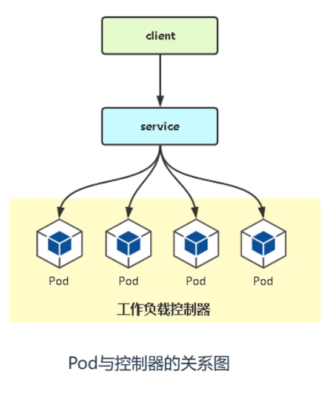

## 第1章  k8s 介绍

Kubernetes是Google 2014年创建管理的，是Google 10多年大规模容器管理技术Borg的开源版本。

它是容器集群管理系统，是一个开源的平台，可以实现容器集群的自动化部署、自动扩缩容、维护等功能。


### 1.1 功能特点

-   负载均衡
-   服务发现
-   存储编排
-   自动回滚部署
-   自动完成装箱计算
-   自我修复
-   密钥和配置管理


### 1.2 历史发展

1.   物理机部署
2.   虚拟机部署
3.   容器化部署


### 1.3 架构和组件


-   Control Plane master

主节点，控制面板 ，不需要很高性能，不跑任务，通常一个就行了，也可以开多个主节点来提高集群可用度。


-   Controller manager 

负责维护集群的状态，比如故障检测、自动扩展、滚动更新等


-   etcd

数据库, 保存了整个集群的状态


-   api server

提供资源操作的唯一入口API


-   scheduler

负责资源调度，按照预定的调度策略将 Pod 调度到相应的机器上；

 

-   kubectl

命令行交互指令 , 类似于 docker....


-   kubelet 

负责维护容器的生命周期，同时也负责 Volume（CSI）和网络（CNI）的管理


-   kube-proxy

负责为 service 提供 集群内部的服务发现和负载均衡


-   kubeadmin

k8s集群简化搭建的脚手架 


-   pod

Pod是kubernetes中最小的资源管理组件，Pod也是最小化运行容器化应用的资源对象，在一个Pod中同时运行一个或多个容器。


-   node

工作节点，可以是虚拟机或物理计算机，任务都在这里跑，机器性能需要好点；通常都有很多个，可以不断加机器扩大集群；每个工作节点由主节点管理


-   deployments

最常见的控制器，用于部署和管理 pod


-   service

为一组pod 提供负载均衡，对外提供访问入口


-   job


-   volume


-   namespace

命令空间，将资源对象从逻辑上隔离，从而形成多个虚拟集群


-   label

标签，附加到某个资源上，用于关联对象


### 1.4 minikube部署k8s集群

minikube官网 https://minikube.sigs.k8s.io/docs/start/


下载安装包 https://storage.googleapis.com/minikube/releases/latest/minikube-installer.exe


或者用 powershell

```sh
New-Item -Path 'c:\' -Name 'minikube' -ItemType Directory -Force
Invoke-WebRequest -OutFile 'c:\minikube\minikube.exe' -Uri 'https://github.com/kubernetes/minikube/releases/latest/download/minikube-windows-amd64.exe' -UseBasicParsing

```


```sh
$oldPath = [Environment]::GetEnvironmentVariable('Path', [EnvironmentVariableTarget]::Machine)
if ($oldPath.Split(';') -inotcontains 'C:\minikube'){ `
  [Environment]::SetEnvironmentVariable('Path', $('{0};C:\minikube' -f $oldPath), [EnvironmentVariableTarget]::Machine) `
}

```


相关操作

```shell
# 启动集群
minikube start
# 查看节点。kubectl 是一个用来跟 K8S 集群进行交互的命令行工具
kubectl get node
# 停止集群
minikube stop
# 清空集群
minikube delete --all
# 安装集群可视化 Web UI 控制台
minikube dashboard
```


### 1.5 kubeadm部署k8s集群


### 1.6 rancher部署k8s集群

在linux云服务器上安装 rancher

```
docker run --privileged -d --restart=unless-stopped -p 80:80 -p 443:443 rancher/rancher:stable
```


查看密码

```
docker ps #查看容器id
docker logs 容器id  2>&1 | grep "Bootstrap Password:"
```


登录服务器

http://ip


### 1.7 kubectl指令

查看pods

kubectl get pods


查看node

kubectl get node


查看namespace

kubectl get namespace


查看job

kubectl get job


查看日志

kubectl logs name -f


创建yaml文件

 kubectl apply -f xxx.yaml	


删除ymal文件

kubectl delete -f xxx.yaml	


删除deployment 

kubectl delete deployment  [name]


## 第2章 k8s基础

### 2.1 命名空间

创建命名空间

kubectl create namespace wlm


使用命名空间

kubectl get pods -n wlm


### 2.2 deployment控制器

主要功能

管理pod，上线部署，副本设定，滚动升级，回滚等


yaml部署

kubectl apply -f web.yaml

```yaml
# web.yaml
apiVersion: apps/v1 # 项目名名和版本号
kind: Deployment # 控制器类型
metadata: # 元数据
	name: web #应用名
	namespace: default # 命名空间
spec:
	replicas: 3 # 副本数量
	selector:
		matchLabels:
			app: web
	template:
		metadata:
			labels:
				app: web # 副本标签
		spec:
			containers:
			- name: web
				image: nginx

```


命令行部署

kubectl create deployment web --image=nginx --replicas=3


deployment与pod关系图




### 2.3 pod

pod是k8s的最小单元，一个pod由一个或多个容器组成。

pod始终部署在node上。


### 2.4 service


### 2.5 创建nginx容器

启动minikube  

minikube start


创建文件 nginx-dep.yml

```yaml
apiVersion: apps/v1
kind: Deployment
metadata:
  name: nginx-deployment
spec:
  selector:
    matchLabels:
      app: nginx
  replicas: 3
  template:
    metadata:
      labels:
        app: nginx
    spec:
      containers:
      - name: nginx
        image: nginx:alpine
        ports:
        - containerPort: 80
```


创建deployments

kubectl apply -f nginx-dep.yml


创建文件

```yaml
apiVersion: v1
kind: Service
metadata:
  name: nginx-service
spec:
  selector:
    app: nginx
  ports:
  - protocol: TCP
    port: 80
    targetPort: 80
    nodePort: 30080
  type: NodePort
```


创建 service

kubectl apply -f nginx-svc.yml


转发url minikube

kubectl port-forward nginx-deployment-7d9d7464fb-mrc4h 30001:80


浏览器访问

http://127.0.0.1:30001


## 第3章 kubusphere


## 第5章 微服务集成


## 第6章 边缘化

