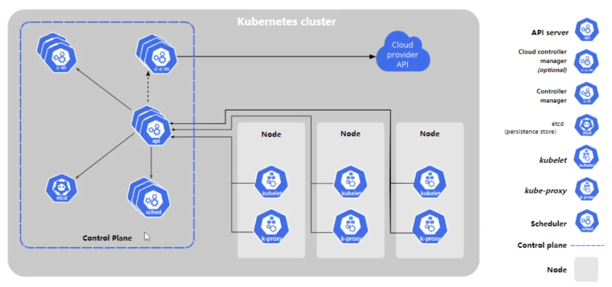

## 第1章  k8s 介绍

Kubernetes是Google 2014年创建管理的，是Google 10多年大规模容器管理技术Borg的开源版本。

它是容器集群管理系统，是一个开源的平台，可以实现容器集群的自动化部署、自动扩缩容、维护等功能。


### 1.1 功能特点

负载均衡

服务发现

存储编排

自动回滚部署

自动完成装箱计算

自我修复

密钥和配置管理


### 1.2 历史发展

1.   物理机部署
2.   虚拟机部署
3.   容器化部署


### 1.3 架构




### 1.4 安装 minikube 伪集群

minikube官网 https://minikube.sigs.k8s.io/docs/start/


下载安装包 https://storage.googleapis.com/minikube/releases/latest/minikube-installer.exe


或者用 powershell

```sh
New-Item -Path 'c:\' -Name 'minikube' -ItemType Directory -Force
Invoke-WebRequest -OutFile 'c:\minikube\minikube.exe' -Uri 'https://github.com/kubernetes/minikube/releases/latest/download/minikube-windows-amd64.exe' -UseBasicParsing

```


```sh
$oldPath = [Environment]::GetEnvironmentVariable('Path', [EnvironmentVariableTarget]::Machine)
if ($oldPath.Split(';') -inotcontains 'C:\minikube'){ `
  [Environment]::SetEnvironmentVariable('Path', $('{0};C:\minikube' -f $oldPath), [EnvironmentVariableTarget]::Machine) `
}

```


### 1.5 安装 云集群


### 1.6 安装 虚拟机集群


## 第2章 k8s基础


## 第3章 kubusphere


## 第4章 运维基础和实践


## 第5章 微服务集成


## 第6章 边缘化

