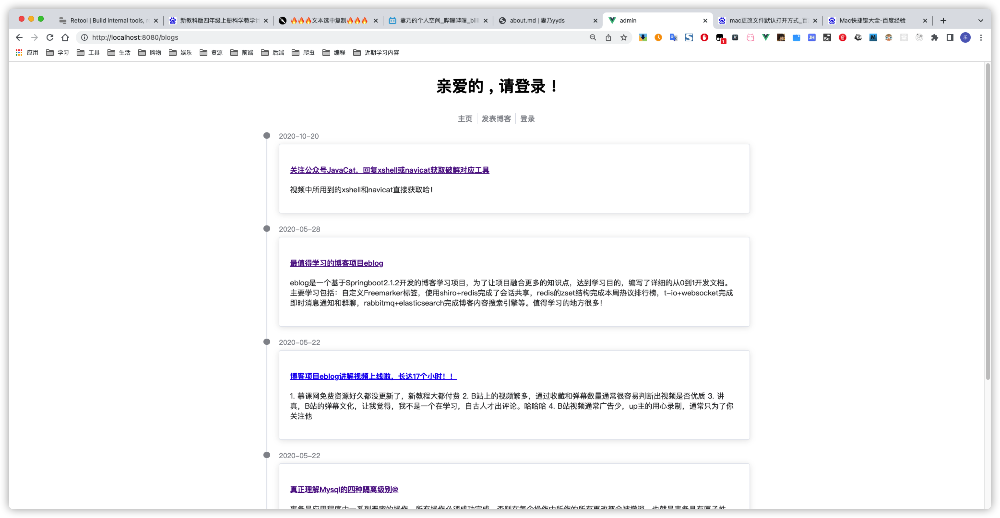
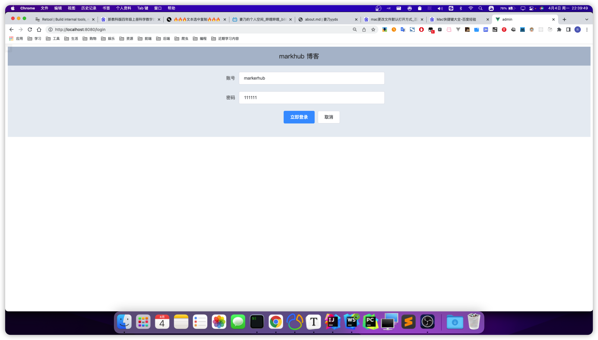
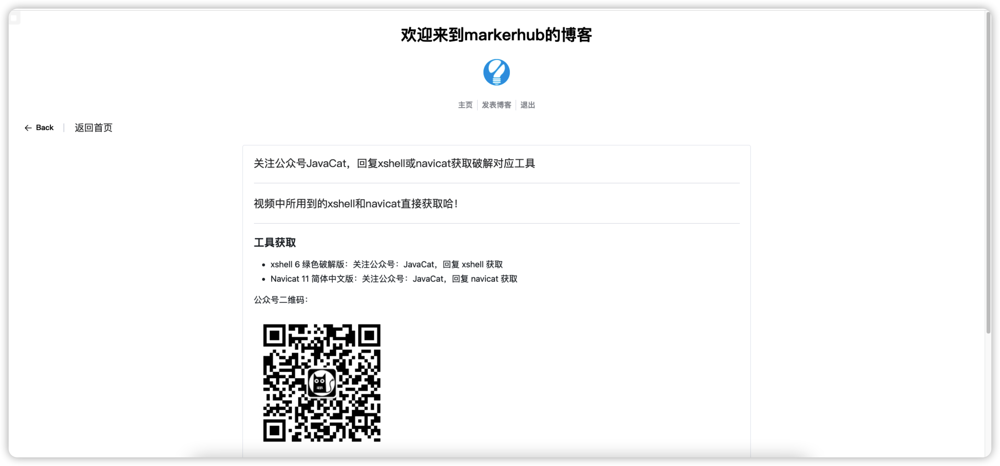
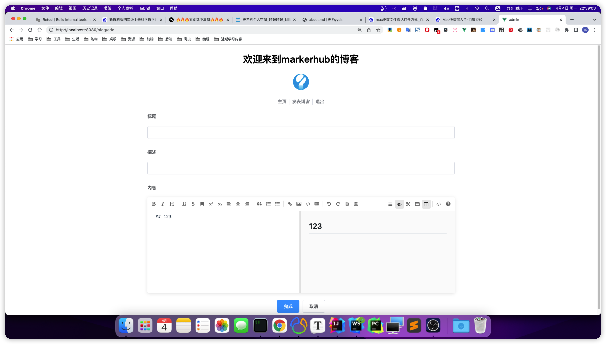

## Markhub博客项目

## 第1章 项目介绍

### 1.1 界面介绍

首页

登录页

详情页

发表页

### 1.2 技术选型

前端 vue3 + elementui + axios

后端 springboot2 + shiro + jwt + redis

数据库 mysql

### 1.3 文件介绍

site  ---- 网站首页

api  ---- 后端

vueblog.sql   ----  数据库脚本

### 1.4 部署

数据库

新建vueblog数据库, 导入sql文件

修改application.yml中的数据源为自己的用户密码

前端

npm install 

npm run serve

后端

等待maven下载完成后直接启动即可

